<!-- Slideshow container -->

  <!-- Full-width images with number and caption text -->
  

    
1 / 3

    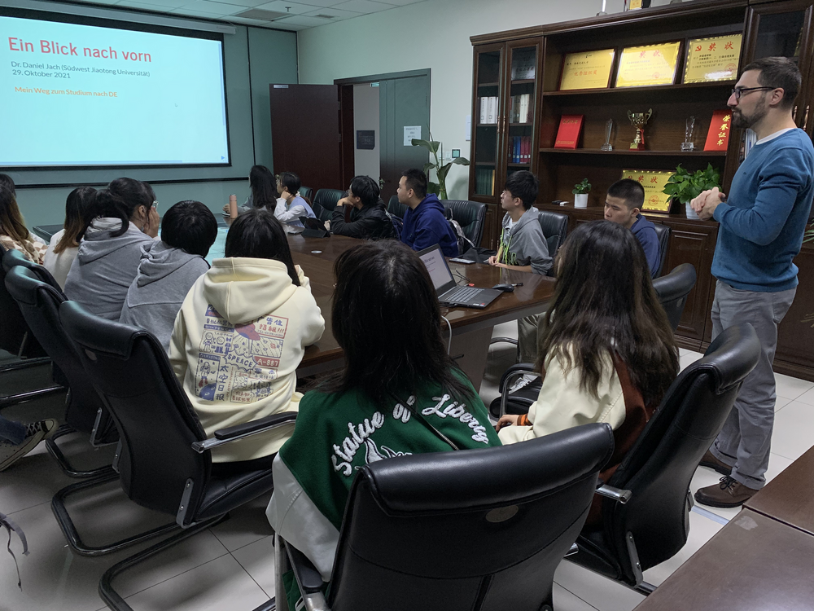
    <!-- 
Caption Text
 -->
  

  

    
2 / 3

    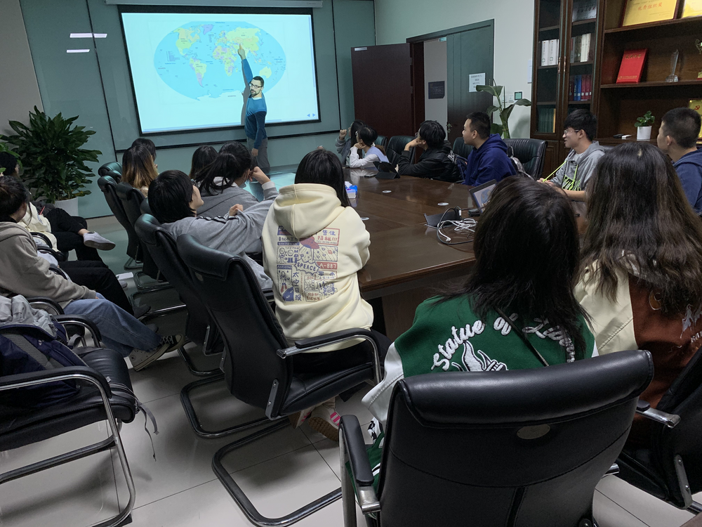
    <!-- 
Caption Text
 -->
  

  

    
3 / 3

    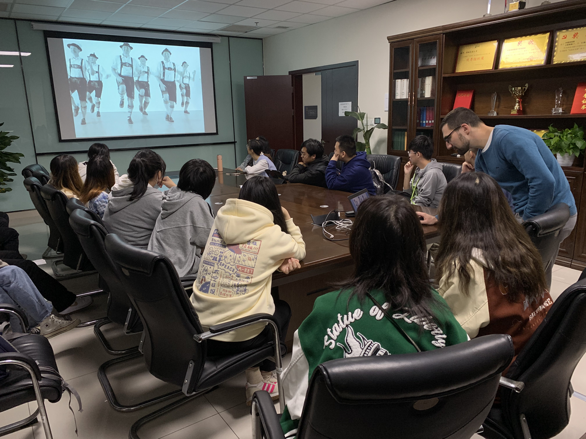
    <!-- 
Caption Text
 -->
  

  
  

    
4 / 4

    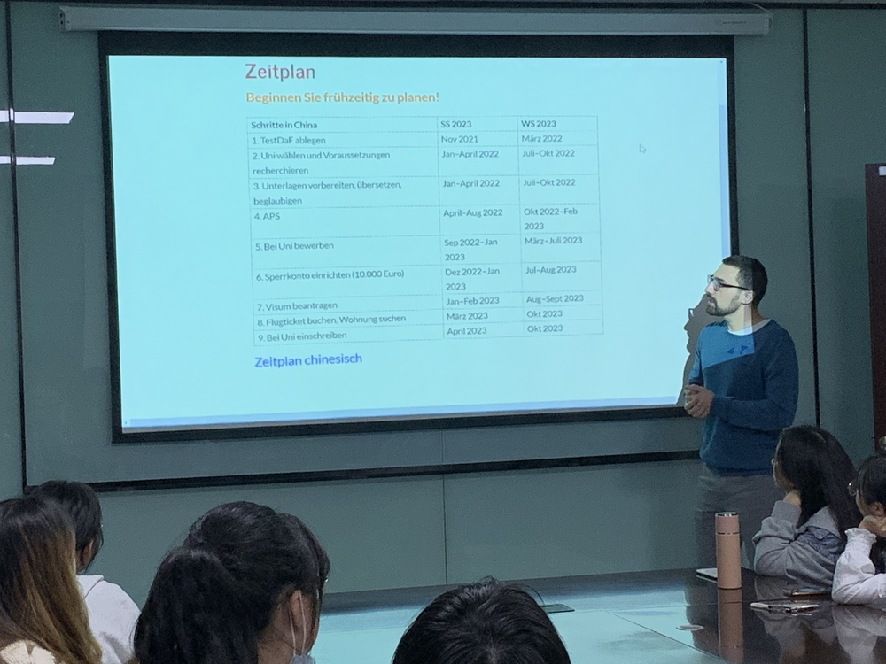
    <!-- 
Caption Text
 -->
  

  
  

    
5 / 5

    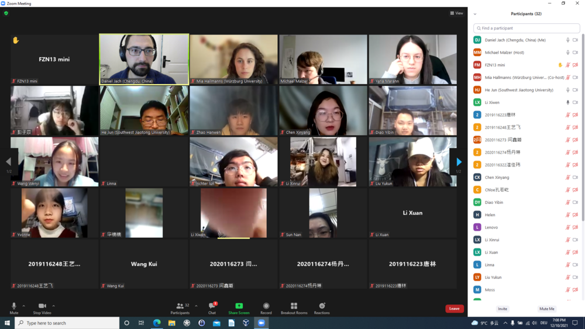
    <!-- 
Caption Text
 -->
  

  
  

    
6/ 6

    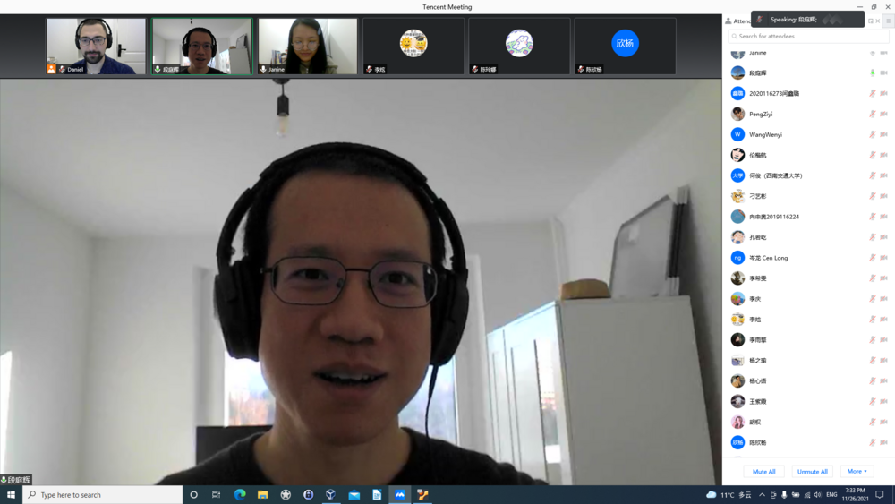
    <!-- 
Caption Text
 -->
  

  
  

    
7 / 7

    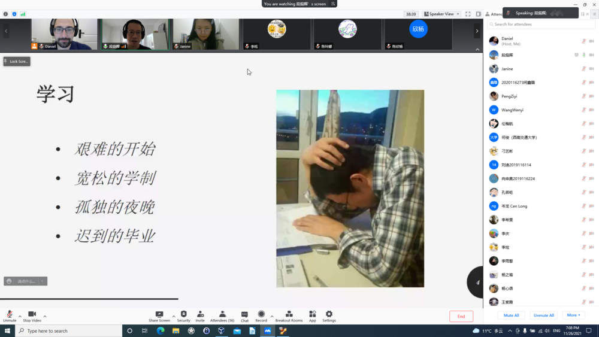
    <!-- 
Caption Text
 -->
  

  
  

    
8 / 8

    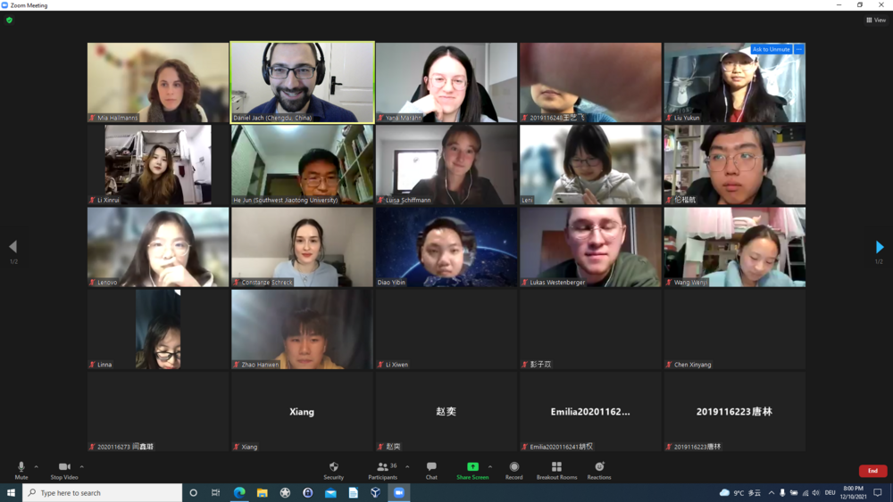
    <!-- 
Caption Text
 -->
  

  
  

    
9 / 9

    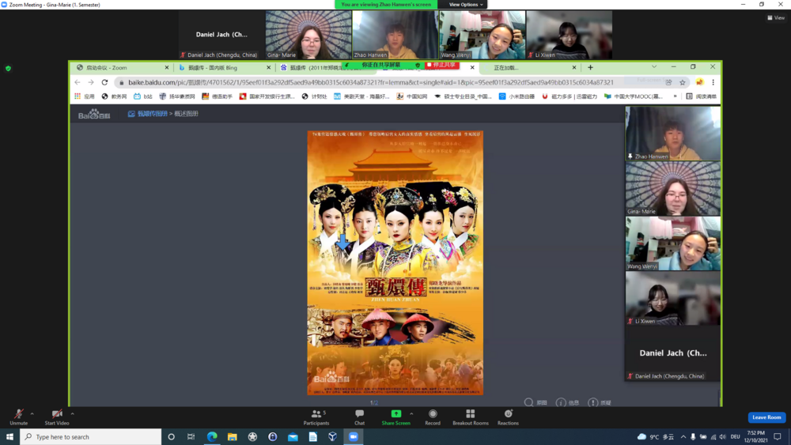
    <!-- 
Caption Text
 -->
  

  
  

    
10 / 10

    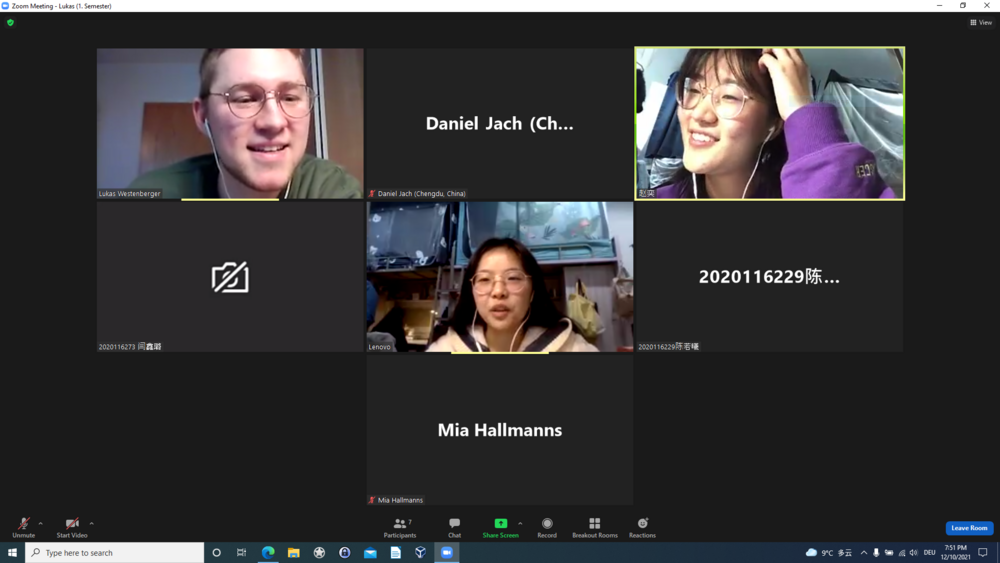
    <!-- 
Caption Text
 -->
  

  
  

    
11 / 11

    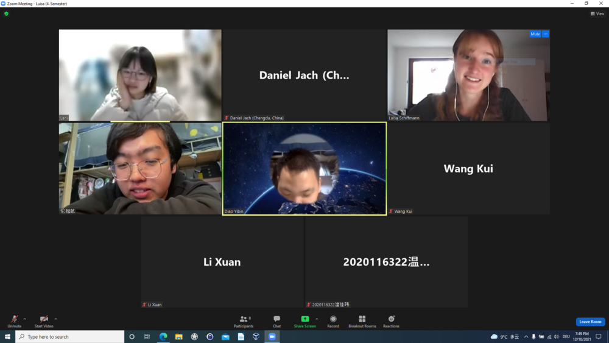
    <!-- 
Caption Text
 -->
  

  
  

    
12 / 12

    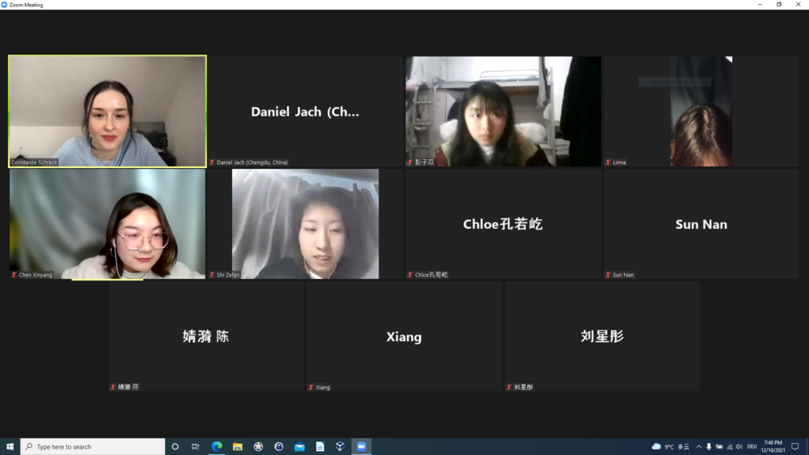
    <!-- 
Caption Text
 -->
  

  
  

    
13 / 13

    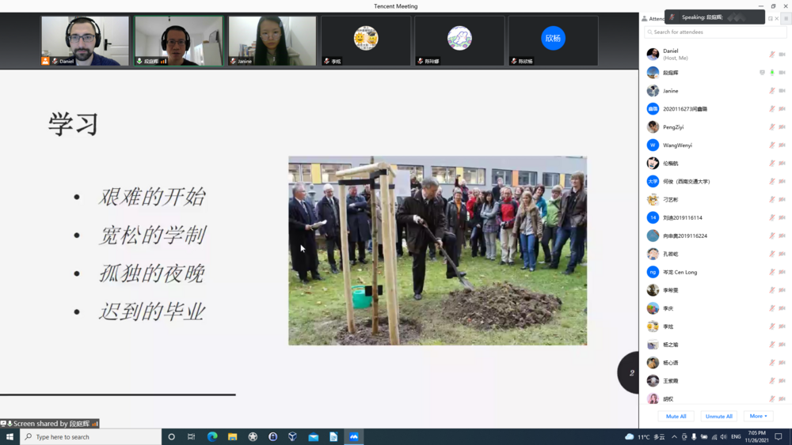
    <!-- 
Caption Text
 -->
  

  <!-- Next and previous buttons -->
  <a class="prev" onclick="plusSlides(-1)">&#10094;</a>
  <a class="next" onclick="plusSlides(1)">&#10095;</a>

 

<!-- The dots/circles -->

  
  
  
  
  
  
  
  
  
  
  
  
  

 

 

 

4,74/5 (35 Bewertungen)

> Das war sehr inhaltsreich, informativ und interessant. Ich habe viel gelernt, was ich sonst nicht leicht lernen kann. (Jianing)

> Lihong Dai erzählt uns ihr Universitätsleben in Deutschland. Das ist interessant, das habe ich noch nie erlebt. (Ziyi)

> Nach diesem Vortrag ist mir klarer, wie ich einen Studium in Deutschland machen kann. (Jingyi)

> Das hat mich dazu gebracht, mich nach einem Studium in Deutschland zu sehnen. (Xinyang)

> Die Erfahrung von Frau Dai von China nach Deutschland gefällt mir sehr. Ihre Arbeiten am Deutschlernen und Eifer begeistern mich. (Yukun)

> Dieser Vortrag gibt uns die Möglichkeit, etwas über das Lernen und Leben in Deutschland zu lernen. Und wir konnten Herrn Duan direkt Fragen stellen und seine Antworten bekommen. Wir haben durch den Vortrag viel gelernt. Dies ist sehr hilfreich für Studenten, die in Deutschland studieren werden. (Jingwen)

> Weil Herr Duan seit vielen Jahren in Deutschland lebt und studiert hat, wirken seine Beschreibungen besonders real und aufrichtig. (Zhiyu)

**Guiling Wu** arbeitet im Bereich Kultur & Presse am Deutschen Generalkonsulat in Chengdu. Sie hat an der Fremdsprachenhochschule Sichuan (四川外国语大学) Germanistik studiert und anschließend in der Schweiz akademische und praktische Erfahrungen im Handel gemacht. Sie erzählt von ihrem Weg in die Schweiz und zurück nach China und was dabei neben dem Studium noch wichtig war.  
 
<strike><b>Zeit</b> 29.10.2021, 19 Uhr <b>Ort</b> t.b.a.</strike>
Nicht genehmigt.

{: .img-left}

**Ersatz** Als Ersatz für den nicht genehmigten Vortrag von Guiling Wu spielen wir ein Deutschland-Quiz, schauen ein Video über das Studium und Leben chinesischer Studierender in Deutschland und Sie lernen Wege zum Studium in Deutschland kennen.
 
**Zeit** 29.10.2021, 19 Uhr **Ort** Gebäude 3, Raum 30818 
**Vortrag** <a href="https://daniel-jach.github.io/ein-blick-zurueck-nach-vorn/vortrag.pdf" target="_blank">Link</a>

{: .img-left}

**Lihong Dai** lebt in Berlin und ist im Bereich *Technologie Consulting* tätig. Sie hat Germanistik in China studiert und anschließend einen Master *Deutsch als Fremdsprache* in Deutschland erworben. Sie erzählt ihre Geschichte, wie sie von China nach Deutschland kam und über Leben, Studium und Arbeit in ihrer neuen Heimat.  
 
**Zeit** 11.11.2021, 19 Uhr **Ort** Online auf Tencent Meeting ([https://meeting.tencent.com/dm/FhAelHuZcsMG
](https://meeting.tencent.com/dm/FhAelHuZcsMG))

{: .img-left}

**Tinghui Duan** promoviert seit 2018 in der Computerlinguistik der Universität Jena und arbeitet als wissenschaftlicher Mitarbeiter im Jenaer JULIE Lab. Er erzählt von seinem Studium, das ihn von der Renmin University of China (中国人民大学) in Beijing nach Deutschland, Österreich, Jordanien und in die Türkei geführt hat, und von seinem Leben als Forscher in Deutschland.  
 
**Zeit** 26.11.2021, 19 Uhr **Ort** Online auf Tencent Meeting ([https://meeting.tencent.com/dm/2vIyBUduESio](https://meeting.tencent.com/dm/2vIyBUduESio))

{: .img-left}

**Studierende der Universität Würzburg** aus dem Studiengang *Modern China* kommen zum digitalen Erfahrungsaustausch. Die Studierenden zeigen Ihnen ihren Campus und erzählen von ihrem Leben. Sie haben auch Fragen an Sie und das Leben und Studium in China mitgebracht.    
 
**Zeit** 10.12.2021, 19 Uhr **Ort** Online auf Zoom ([Link](https://uni-wuerzburg.zoom.us/j/98902813130?pwd=cmsyOGVqRFQrM2FZcSs2OU1ZRFhIQT09))

{: .img-left}

Alles, was Sie für Ihren Weg von China nach Deutschland wissen müssen: Wieso soll ich in DE studieren? Was soll ich studieren? Wo soll ich studieren? Wie soll ich das bezahlen? Antworten finden Sie <a href="https://daniel-jach.github.io/ein-blick-zurueck-nach-vorn/vortrag.pdf" target="_blank">hier</a>.

