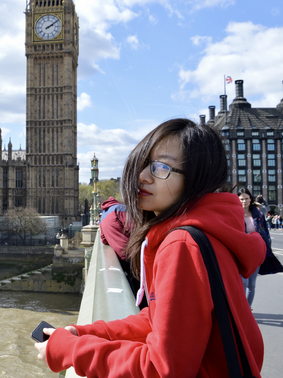

  

  

**SUN Yu** lebt in Shanghai und arbeitet in der Risikokontrolle bei PayPal. Sie hat das Germanistik-Bachelorstudium an der Universität für Sprache und Kultur in Peking absolviert und anschließend in Konstanz und Jena Wirtschaftsdeutsch, Tourismusmanagement und Deutsch als Fremd- und Zweitsprache studiert. Während dieser Zeit war sie auch mit dem europäischen Austauschprogramm *Erasmus* für einen Studienaufenthalt in Großbritannien. 
  

  

  22.09.2022, 19 Uhr [Link zum Zoom-Meeting](https://us06web.zoom.us/j/87829276998?pwd=TFMzc1hmU2tRNlJ0OTJ5MWxaVUtmdz09) Meeting ID: 878 2927 6998 Passcode: 124468
  

  

  

**Zhixuan Fu** lebt in Shanghai und arbeitet im Bereich Interkulturelles Training & Bildungsaustausch zwischen China und Deutschland. Sie hat Germanistik an der Zhejiang Universität studiert und anschließend einen Deutsch-als-Fremdsprache-Master in Heidelberg gemacht. Sie erzählt von ihren Erfahrungen in Deutschland, wie und warum sie ihr Studienfach gewählt hat und berichtet über Arbeitsmöglichkeiten im Bereich Kulturaustausch.
  

  

  <b>Zeit</b> 25.10.2022, 19:30 Uhr [Link zum Zoom-Meeting](https://us06web.zoom.us/j/87829276998?pwd=TFMzc1hmU2tRNlJ0OTJ5MWxaVUtmdz09) Meeting ID: 878 2927 6998 Passcode: 124468
  

  

  

**Wang Yili** lebt in Shanghai und arbeitet an der East China University of Science and Technology (ECUST). Sie hat an der Peking Universität in deutscher Literatur promoviert und währenddessen an der Freien Universität Berlin und der Humboldt-Universität studiert. Sie erzählt von ihrer Zeit in Deutschland, ihrer Promotion und ihrer Arbeit als Forscherin in Shanghai.
  

  

  <b>Zeit</b> t.b.a. [Link zum Zoom-Meeting](https://us06web.zoom.us/j/87829276998?pwd=TFMzc1hmU2tRNlJ0OTJ5MWxaVUtmdz09) Meeting ID: 878 2927 6998 Passcode: 124468
  

  

  

  **Studierende der Universität Würzburg** aus dem Studiengang *Modern China* kommen zum digitalen Erfahrungsaustausch. Die Studierenden zeigen Ihnen ihren Campus und erzählen von ihrem Leben. Sie haben auch Fragen an Sie und das Leben und Studium in China mitgebracht. Das Treffen ist nur für Studierende der SWJTU geöffnet. 
  

  

**Zeit** t.b.a., 19 Uhr **Ort** Online auf Zoom (Link inaktiv)
  

