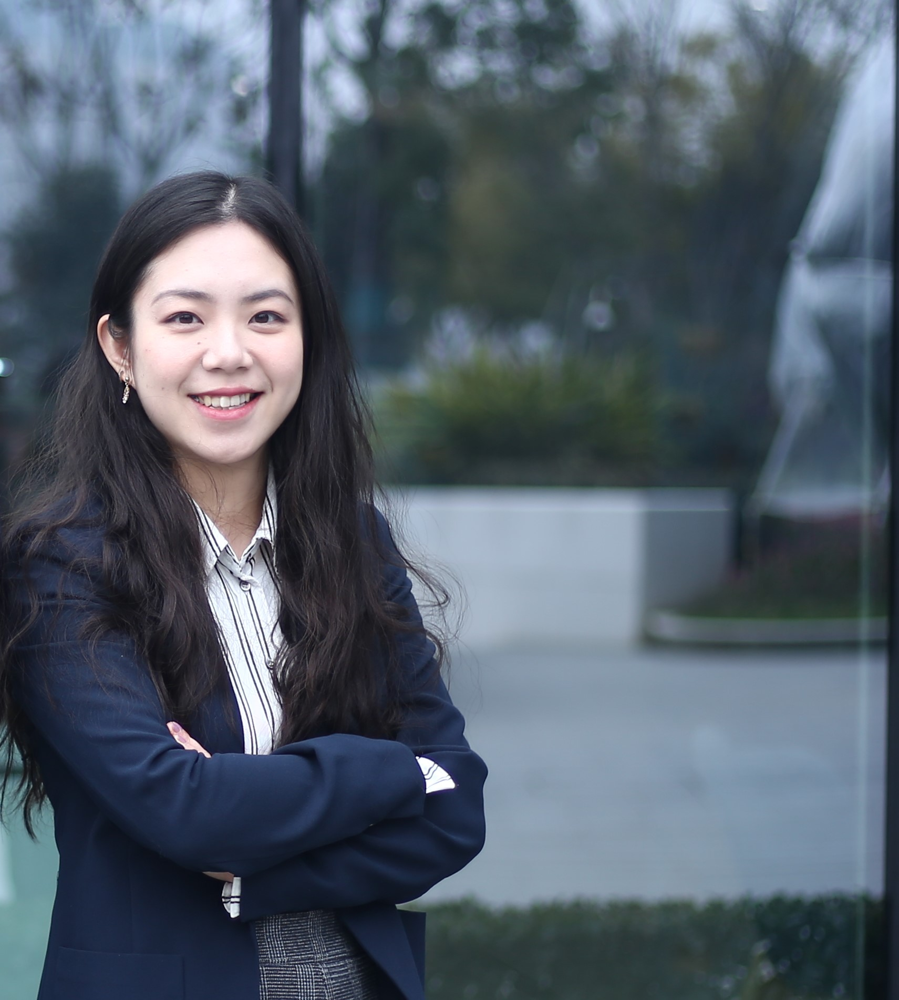
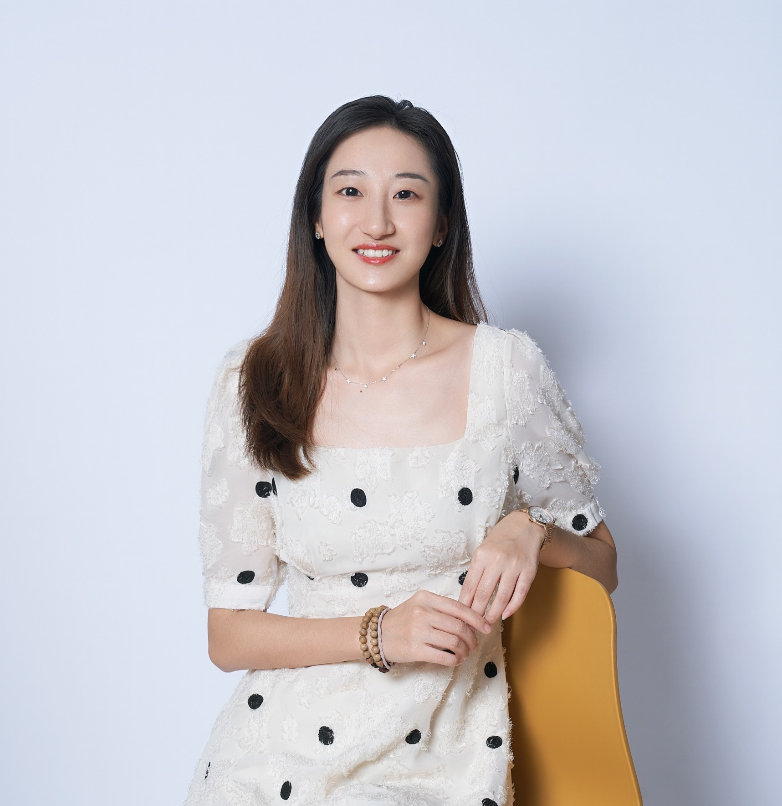
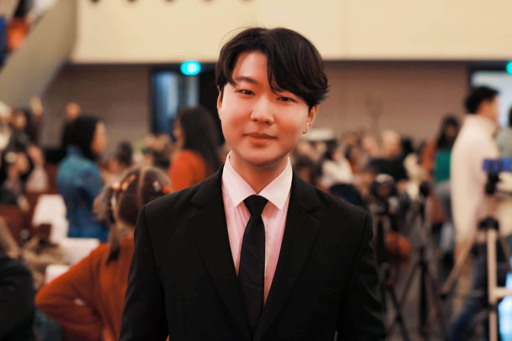

<center>
```{r slideshow, results='asis', echo=FALSE}
source('./../_extensions/fcn_image_carousel.R')
image_carousel('slideshow_images/')
```
</center>


<div class="row">
  

  <p class="text-right" markdown="1">
**Yingyue Wang** (王盈月) lebt in Chengdu und arbeitet als Projektmanagerin bei der Deutschen Außenhandelskammer (AHK). Nach dem Studium der Germanistik an der Universität für Sprache und Kultur in Xi'an ging sie nach Deutschland, um an der Hochschule Konstanz Wirtschaftssprache und Tourismusmanagement zu studieren. Anschließend arbeitete sie sechs Jahre bei der AHK in Chengdu. Nun nimmt sie wieder Abschied von China und beginnt eine neue Tätigkeit bei einer Unternehmensberatung in Deutschland.
  </p>
  <p class="text-right" markdown="1">
  **13.09.2023, 19 Uhr**<br>[Link zum Tencent-Meeting](https://meeting.tencent.com/dm/BNKuOkmHil1i)<br>Meeting ID: 214-626-497
  </p>
</div>


<div class='row'>
  
  <p class='text-right' markdown='1'>
  **Yamei Liu** (柳雅玫) lebt in Stuttgart und arbeitet als Personalmanagerin bei Screens, einem Anbieter von Marktinformationen im Bereich Infotainmentsysteme für Automobile. Sie studierte Germanistik in Mianyang und war während ihres Studiums als Au-pair in Deutschland. Anschließend arbeitete sie sechs Jahre lang als Assistentin der Geschäftsführung in einer Bank in Shenzhen, wo sie 2022 auch ihren MBA absolvierte.
  </p>
  <p class="text-right" markdown="1">
  **26.10.2023, 19 Uhr**<br>[Link zum Tencent-Meeting](https://meeting.tencent.com/dm/bP2ajO6axmqT)<br>Meeting ID: 580-838-477
  </p>
</div>

<div class='row'>
  
  <p class='text-right' markdown='1'>
  **Mingyang He** (赫明阳) arbeitet als Dateningenieur bei der Deutschen Bahn AG. Er schloss 2017 sein Germanistikstudium an der Ocean University of China ab und setzte sein Studium an der Universität Heidelberg fort, wo er seinen Master in Germanistik im Kulturvergleich absolvierte. Während dieser Zeit erwarb er auch seinen Bachelor in Computerlinguistik und arbeitete nacheinander als wissenschaftliche Hilfskraft in der Computerlinguistik bei der HD NLP Group, am Leibniz-Institut für Deutsche Sprache und am Universitätsklinikum Heidelberg Dieterich Lab.
  </p>
  <p class="text-right" markdown="1">
  **26.11.2023, 19 Uhr**<br>[Link zum Tencent-Meeting](https://meeting.tencent.com/dm/y8SlKJoVrcuN)<br>Meeting ID: 298-732-646
  </p>
</div>
