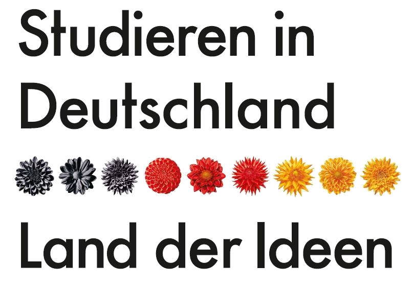

{: title="Xuanzang aka Tang Seng reist nach Westen." .img-top}

Der Langsamste, der sein Ziel nicht aus den Augen verliert, geht immer noch geschwinder als der, der ziellos umherirrt.   (Gotthold Ephraim Lessing)

 

Wohin führt mein Weg nach dem Studium? Welchen Beruf wähle ich? Wer will ich werden? Die Antworten auf solche Fragen können nur Sie selbst finden. In *Ein Blick zurück nach vorn* haben Sie aber die Gelegenheit, sich die Antworten anderer anzuhören. Unsere Vortragenden sind Absolventen der Germanistik und in Wissenschaft, Wirtschaft oder Staatsdienst erfolgreich. Sie werfen einen Blick zurück auf ihr Studium in China, die Zeit danach und ihren Weg von China in die Welt und erzählen von Leben und Arbeit in Deutschland und anderswo. Ihre Geschichten sind persönlich, spannend, ermutigend und inspirierend. Nach jedem Vortrag erfahren Sie noch mehr über Studien-, Forschungs- und Arbeitsmöglichkeiten in Deutschland. Am Ende der Reihe treffen Sie außerdem auf andere Studierende in Deutschland, mit denen Sie Fragen, Antworten, Erfahrungen und Zukunftsträume austauschen können. 

## Studieren in D

Alles, was Sie für Ihren Weg von China nach Deutschland sonst noch wissen müssen: Wieso soll ich in DE studieren? Was soll ich studieren? Wo soll ich studieren? Wie soll ich das bezahlen? Antworten finden Sie hier.

* <a href="./material/vortrag.pdf" target="_blank">Deutsch-chinesische PDF-Slides</a> mit vielen nützlichen Infos zum Studium in Deuschland (Schritt-für-Schritt nach D, Zeitplan, Sprachprüfungen, Stipendien, ...). 
* <a href="https://www.daad.org.cn/de/studieren-forschen-lehren-in-china/germanistik/daad-lektoren/">DAAD-Lektoren in Ihrer Nähe</a> finden und kontaktieren
* [Stipendiendatenbank](https://www2.daad.de/deutschland/stipendium/datenbank/de/21148-stipendiendatenbank/) nach Stipendium durchsuchen
* Mit [Myguide](https://www.myguide.de/en/) den Weg nach D finden

Den DAAD auf Chinesisch über WeChat kontaktieren

