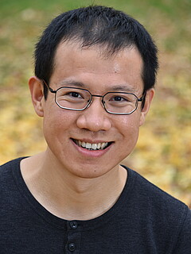

{: title="Xuanzang aka Tang Seng reist nach Westen." .img-top}

Der Langsamste, der sein Ziel nicht aus den Augen verliert, geht immer noch geschwinder als der, der ziellos umherirrt.   (Gotthold Ephraim Lessing)

 

Wohin führt mein Weg nach dem Studium? Welchen Beruf wähle ich? Wer will ich werden? Die Antworten auf solche Fragen können nur Sie selbst finden. In *Ein Blick zurück nach vorn* haben Sie aber die Gelegenheit, sich die Antworten anderer anzuhören. Unsere Vortragenden sind Absolventen der Germanistik und in Wissenschaft, Wirtschaft oder Staatsdienst erfolgreich. Sie werfen einen Blick zurück auf ihr Studium in China, die Zeit danach und ihren Weg von China in die Welt und erzählen von Leben und Arbeit in Deutschland und anderswo. Ihre Geschichten sind persönlich, spannend, ermutigend und inspirierend. Am Ende der Reihe treffen Sie außerdem auf andere Studierende in Deutschland, mit denen Sie Fragen, Antworten, Erfahrungen und Zukunftsträume austauschen können. 

{: .img-left}

**Guiling Wu** hat Germanistik studiert und arbeitet jetzt am Deutschen Generalkonsulat in Chengdu. Text Text Text Text Text Text Text Text Text Text Text Text Text Text Text Text Text Text Text Text Text Text Text Text Text Text Text Text Text Text Text Text Text Text Text Text Text Text Text Text Text Text Text Text Text Text Text Text Text Text Text Text Text Text Text Text Text Text Text Text  
 
**Zeit** t.b.a. **Ort** t.b.a.

{: .img-left}

**Tingui Duan** promoviert seit 2018 in der Computerlinguistik der Universität Jena und arbeitet als wissenschaftlicher Mitarbeiter im Jenaer JULIE Lab. Er erzählt von seinem Studium, das ihn von der Renmin University of China (中国人民大学) in Beijing nach Deutschland, Österreich, Jordanien und in die Türkei geführt hat, und von seinem Leben als Forscher in Deutschland.  
 
**Zeit** t.b.a. **Ort** t.b.a.

{: .img-left}

**Lihong** hat Germanistik in China und Deutschland studiert, hat dann in Deutschland ein Unternehmen gegründet, heute im Bereich Consulting in Deutschland tätig. Text Text Text Text Text Text Text Text Text Text Text Text Text Text Text Text Text Text Text Text Text Text Text Text Text Text Text Text Text Text Text Text Text Text Text Text Text   
 
**Zeit** t.b.a. **Ort** t.b.a.

{: .img-left}

**Studierende der Universität Würzburg** aus dem Studiengang *Modern China* kommen zum digitalen Erfahrungsaustausch. Die Studierenden zeigen Ihnen ihren Campus und erzählen von ihrem Leben. Sie haben auch Fragen an Sie und das Leben und Studium in China mitgebracht.    
 
**Zeit** t.b.a. **Ort** t.b.a.

