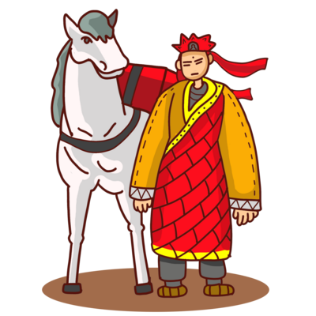

{: title="Xuanzang aka Tang Seng reist nach Westen." .img-top}

Der Langsamste, der sein Ziel nicht aus den Augen verliert, geht immer noch geschwinder als der, der ziellos umherirrt.   (Gotthold Ephraim Lessing)

 

Wohin führt mein Weg nach dem Studium? Welchen Beruf wähle ich? Wer will ich werden? Die Antworten auf solche Fragen können nur Sie selbst finden. In *Ein Blick zurück nach vorn* haben Sie aber die Gelegenheit, sich die Antworten anderer anzuhören. Unsere Vortragenden sind Absolventen der Germanistik und in Wissenschaft, Wirtschaft oder Staatsdienst erfolgreich. Sie werfen einen Blick zurück auf ihr Studium in China, die Zeit danach und ihren Weg von China in die Welt und erzählen von Leben und Arbeit in Deutschland und anderswo. Ihre Geschichten sind persönlich, spannend, ermutigend und inspirierend. Nach jedem Vortrag erfahren Sie noch mehr über Studien-, Forschungs- und Arbeitsmöglichkeiten in Deutschland. Am Ende der Reihe treffen Sie außerdem auf andere Studierende in Deutschland, mit denen Sie Fragen, Antworten, Erfahrungen und Zukunftsträume austauschen können. 

**Guiling Wu** arbeitet im Bereich Kultur & Presse am Deutschen Generalkonsulat in Chengdu. Sie hat an der Fremdsprachenhochschule Sichuan (四川外国语大学) Germanistik studiert und anschließend in der Schweiz akademische und praktische Erfahrungen im Handel gemacht. Sie erzählt von ihrem Weg in die Schweiz und zurück nach China und was dabei neben dem Studium noch wichtig war.  
 
<strike><b>Zeit</b> 29.10.2021, 19 Uhr <b>Ort</b> t.b.a.</strike>
Nicht genehmigt.

{: .img-left}

**Ersatz** Als Ersatz für den nicht genehmigten Vortrag von Guiling Wu spielen wir ein Deutschland-Quiz, schauen ein Video über das Studium und Leben chinesischer Studierender in Deutschland und Sie lernen Wege zum Studium in Deutschland kennen.
 
**Zeit** 29.10.2021, 19 Uhr **Ort** Gebäude 3, Raum 30818 
**Vortrag** <a href="https://daniel-jach.github.io/ein-blick-zurueck-nach-vorn/vortrag/vortrag.html" target="_blank">Link</a>

{: .img-left}

**Lihong Dai** lebt in Berlin und ist im Bereich *Technologie Consulting* tätig. Sie hat Germanistik in China studiert und anschließend einen Master *Deutsch als Fremdsprache* in Deutschland erworben. Sie erzählt ihre Geschichte, wie sie von China nach Deutschland kam und über Leben, Studium und Arbeit in ihrer neuen Heimat.  
 
**Zeit** 11.11.2021, 19 Uhr **Ort** t.b.a.

{: .img-left}

**Tinghui Duan** promoviert seit 2018 in der Computerlinguistik der Universität Jena und arbeitet als wissenschaftlicher Mitarbeiter im Jenaer JULIE Lab. Er erzählt von seinem Studium, das ihn von der Renmin University of China (中国人民大学) in Beijing nach Deutschland, Österreich, Jordanien und in die Türkei geführt hat, und von seinem Leben als Forscher in Deutschland.  
 
**Zeit** 26.11.2021, 19 Uhr **Ort** t.b.a.

{: .img-left}

**Studierende der Universität Würzburg** aus dem Studiengang *Modern China* kommen zum digitalen Erfahrungsaustausch. Die Studierenden zeigen Ihnen ihren Campus und erzählen von ihrem Leben. Sie haben auch Fragen an Sie und das Leben und Studium in China mitgebracht.    
 
**Zeit** t.b.a. **Ort** t.b.a.

