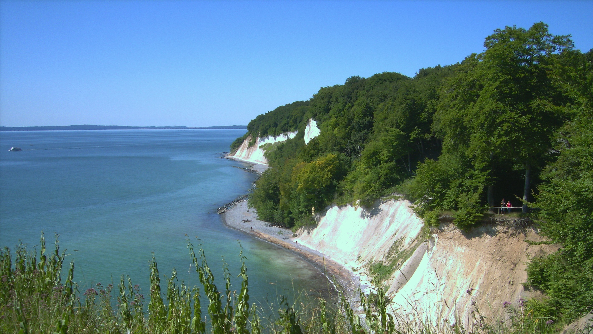
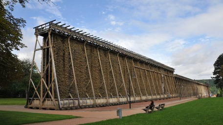
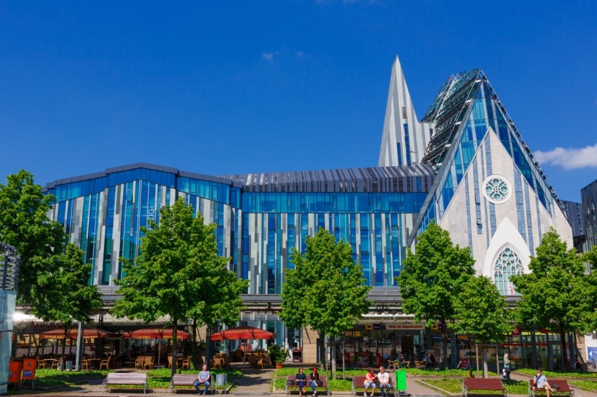
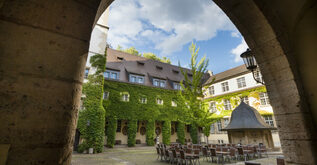
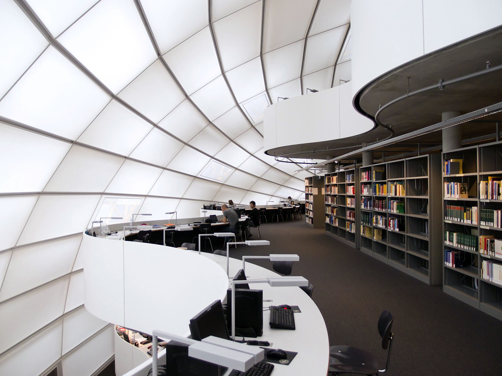
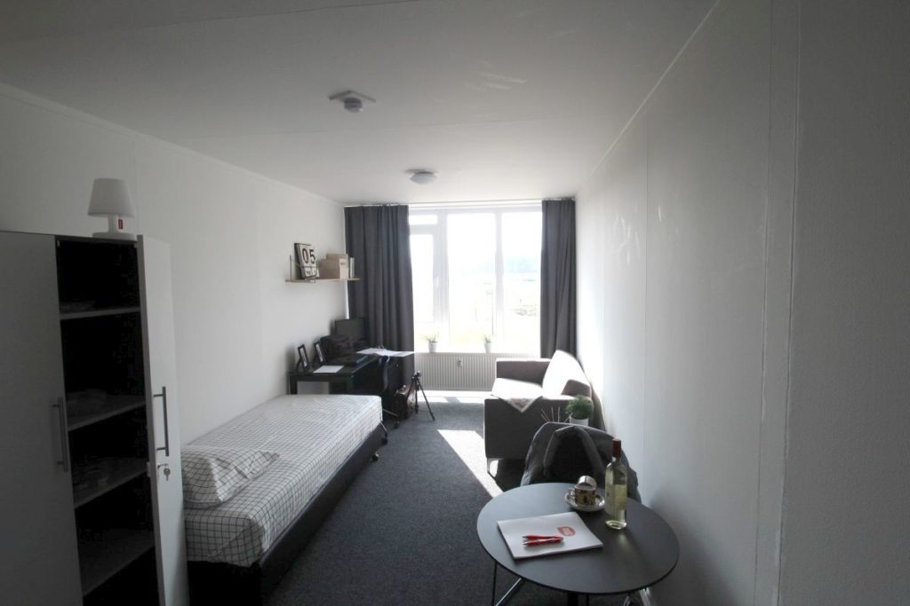
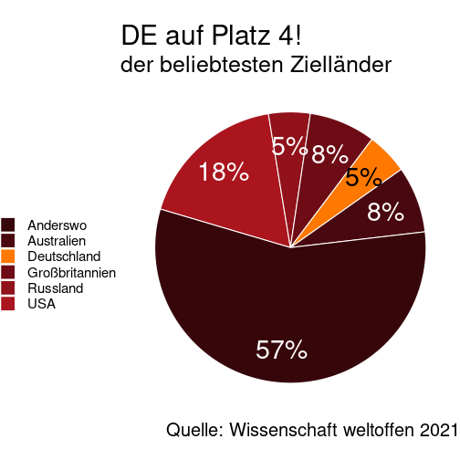
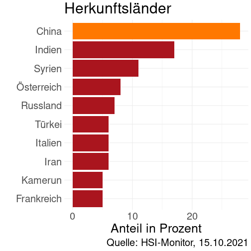
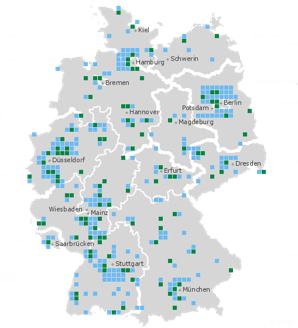

Ein Bick nach vorn
========================================================
author: Dr. Daniel Jach (Südwest Jiaotong Universität)
date: 29. Oktober 2021
autosize: true
css: vortrag.css
transition: rotate

<emph>Mein Weg zum Studium nach DE</emph>

Wo steht dieses Schloss?
========================================================

* In Disneyland
* In Deutschland
* In Sichuan

Wo liegt dieser Berg?
========================================================

* Auf dem Mond (月亮)
* Am Nordpol (北极)
* In Deutschland

Wo liegt diese Insel?
========================================================

* In Italien
* Auf Hainan
* In Deutschland

Wie finden Sie diesen Hut?
========================================================

👎 Schrecklich! &#x2190;---&#x2192; Sehr schön!👍

Was machen Sie in diesem Haus?
========================================================

* Salzwasser (盐水) einatmen (吸气)
* Holz (木头) essen
* Wäsche (衣服) waschen (洗)

Was ist das?
========================================================

***

* Ein norddeutscher Weihnachtsbaum (Jöölboom)
* Ein altmodischer Wifi-Router (无线路由器)
* Ein traditioneller deutscher Fächer (扇子)

Was machen diese Männer?
========================================================

<video width="100%" controls>
  <source src="./vortrag-material/video-schuhplattler.webm">
</video>

* Einen deutschen Kampfsport (德国武术) gegen sich selbst
* Traditionelle Deutsche Medizin (德医学) gegen Bein-Schmerzen
* Einen traditionellen Tanz (跳舞晚会) names *Schuhplattler* 

Was können Sie in diesem Haus machen?
========================================================

* Obst und Gemüse kaufen (Obst- und Gemüsemarkt)
* Studieren gehen (Uni Leipzig)
* Moderne Kunst anschauen (Museum, 博物馆)

Was können Sie hier machen?
========================================================

* Alte Kunst anschauen (Museum, 博物馆)
* Schwimmen gehen (Schwimmbad)
* Studierende treffen (Uni München)

Hier können Sie...
========================================================

... mit Freunden nach dem Unterricht essen (Mensa Uni Jena).

Hier können Sie...
========================================================

... vor dem Unterricht lernen (Bibliothek Uni Berlin). 

Hier können Sie...
========================================================

... wohnen (Studierenden-Zimmer Uni Aachen). 

Studieren in DE! (留学德国)
========================================================
incremental: true

Deutschland ist schön, lustig, alt, modern und ... 

<emph>Weltweit beliebter Studienort!</emph>

<emph>Vor allem für Chinesen!</emph>

***

<b>Wieso Deutschland?</b>
<small>
* Hohe Qualität, guter Ruf 世界知名的高学术水平
* Viele Programme und Studienfächer 丰富多彩的课程和专业可供选择
* Kulturelles Leben, interkulturelles Flair 悠久的文化底蕴，独特的国际文化氛围
* 18 Monate Arbeitssuche-Visum 毕业后有充分的时间在德国找工作（18个月)
* Niedrige Kosten 学习费用低廉
</small>

Studieren in DE! (留学德国)
========================================================
incremental: true

<emph>Studieren Sie was Sie wollen, wo Sie wollen!</emph>

***

* 108 Universitäten 108综合大学和理工大学
* 241 Fachhochschulen 241应用科学大学
* 52 Kunst- und Musik-Hochschulen 52艺术学院和音乐学院
* 22 Andere Hochschulen 其他类型高校22所

In DE studieren
========================================================

<b>Universität</b>

|     |     |     |
|-----|-----|-----|
|Fächer 课程设置|Viele Fächer, verschiedene Fachgebiete, z.B. DaF, Germanistik, Maschinenbau, Kunst, Jura, BWL, Soziologie, Theologie, Medizin, Forstwirtschaft, ...|学科较多、专业齐全，包外国德语，德语语言文学，工科，理科，文科，法学，经济学，社会学，神学，医学，农林学等，。。。|
|Abschluss 毕业学位|Bachelor (3-4 Jahre) Master (+2 Jahre) Promotion (+3-5 Jahre)|本科（3-4 年) 硕士（+2 年） 博士（+3-5 年）|
|Schwerpunkt 重点|Akademische Forschung und Lehre|科研与教学并重，强调基础研究和理论知识系统化|

<b>Fachhochschule</b>

|     |     |     |
|-----|-----|-----|
|Fächer 课程设置|Bestimmte Fächer, vor allem Maschinenbau, BWL, Agrarwissenschaften, Design, Krankenpflege, keine Geisteswissenschaften |一般只设有几个专业，但特色极为突出，如工程学，商科，管理，社会学，设计等|
|Abschluss 毕业学位|Bachelor (3-4 Jahre) Master (+2 Jahre)|本科（3-4 年) 硕士（+2 年）|
|Schwerpunkt 重点|Angewandte Forschung, praktischer|除掌握必要的基础理论外，强调与实践的高度结合|

Mein Weg von China nach DE
========================================================
incremental: true

<emph>Vor dem Bachelor</emph>

Mindestens ein Semester an "211" Universität studieren 
至少在国内重点大学就读一个学期

&darr;

APS + Sprachprüfungen 
APS+一定的语言要求

&darr;

Bachelor-Studium in DE 
进入德国大学本科学习

***

<emph>Nach dem Bachelor<emph/>

Bachelor von anerkannter Universität in China 
至少在国内普通高校就读满三个学期

&darr;

APS + Sprachprüfungen 
APS+一定的语言要求

&darr;

Master-Studium in DE 
进入硕士阶段

APS
========================================================
incremental: true

<emph>Akademische Prüfstelle</emph> 
德国驻华使馆文化处留德人员审核部

<emph>[www.aps.org.cn](www.aps.org.cn)</emph>

* Deutsche Botschaft Beijing 
德国驻华使馆文化处提供的服务
* Evaluation akademischer Zeugnisse usw. 
评估学生的大学成绩，审核他的能力
* Interview (Deutsch oder Englisch) 
面谈（德/英)
* Kosten: RMB 2.500 
费用：2500元人民币
* Zertifikat – Visa-Eil-Verfahren 
证书——能更快拿到签证

Sprachprüfungen
========================================================

<emph>TestDaF 德福考试</emph>

[https://www.testdaf.de/](https://www.testdaf.de/de/teilnehmende/mein-testdaf/pruefungsteilnehmende-in-china/)

|     |     |
|-----|-----|
|TestDaF-Institut|德福考试院|
|12 Universitäten in China|中国目前有12个考点|
|3/Jahr: März, Juli, November|中国地区每年 3次考试，分别在 3月，7月和 11月|

<emph>DSH</emph>

[http://dsh.de/](http://dsh.de/)

|     |     |
|-----|-----|
|Jede Universität|各个大学|
|Prüfungsort wird von Universität bestimmt|以德国大学的信息为准|
|Prüfungszeit wird von Universität bestimmt|以德国大学的信息为准|

Zeitplan
========================================================

<emph>Beginnen Sie frühzeitig zu planen!</emph>

|Schritte in China|SS 2023|WS 2023|
|-----|-----|-----|
|1. TestDaF ablegen|Nov 2021|März 2022|
|2. Uni wählen und Voraussetzungen recherchieren|Jan--April 2022|Juli--Okt 2022|
|3. Unterlagen vorbereiten, übersetzen, beglaubigen|Jan--April 2022|Juli--Okt 2022|
|4. APS|April--Aug 2022|Okt 2022--Feb 2023|
|5. Bei Uni bewerben|Sep 2022--Jan 2023|März--Juli 2023|
|6. Sperrkonto einrichten (10.000 Euro)|Dez 2022--Jan 2023|Jul--Aug 2023|
|7. Visum beantragen|Jan--Feb 2023|Aug--Sept 2023|
|8. Flugticket buchen, Wohnung suchen|März 2023|Okt 2023|
|9. Bei Uni einschreiben|April 2023|Okt 2023|

[Zeitplan chinesisch](vortrag-material/zeitplan-chinesisch.png)

uni-assist
========================================================

Bewerbungshilfe für internationale Studierende 
外国学生申请大学服务处

[www.uni-assist.de](www.uni-assist.de)

* Überprüft Bewerbungsunterlagen  对所有外国学生的申请材料进行核实、对入学资格进行认证
* Kosten: Erste Bewerbung EUR 75, jede weitere EUR 30 
费用：第一所大学收费75欧元，之后每所大学收费30欧元
* Bewerbungen online einreichen 
通过uni-assist可以在线提出申请​
* Liste aller 180 uni-assist-Universitäten [www.uni-assist.de](www.uni-assist.de) 
近180所uni-assist大学名单请见uni-assist网站

Infos online
========================================================

[https://www.study-in-germany.de/de/](https://www.study-in-germany.de/de/) Mehrsprachige Info-Seiten vom DAAD für alle, die in Deutschland studieren wollen: Schritt-für-Schritt von Recherche bis Studienbeginn

[https://www.myguide.de/en/](https://www.myguide.de/en/) 
Mehrsprachige DAAD-Seite: Studienfach wählen, Voraussetzungen prüfen, Universität kontaktieren

[DAAD Stipendiendatenbank](https://www2.daad.de/deutschland/stipendium/datenbank/en/21148-scholarship-database/) 
Wo Sie das passende Stipendien für sich finden

[https://www.make-it-in-germany.com/de/](https://www.make-it-in-germany.com/de/) 
Mehrsprachiges Portal der Bundesregierung mit vielfältigen Infos zu Arbeit, Studium und Ausbildung in Deutschland. 

Studieren in DE! (留学德国)
========================================================

<emph>Wie DE mich verändert hat!</emph>

<video width="100%" controls>
  <source src="./vortrag-material/video-how-germany-changed-you.webm">
</video>
